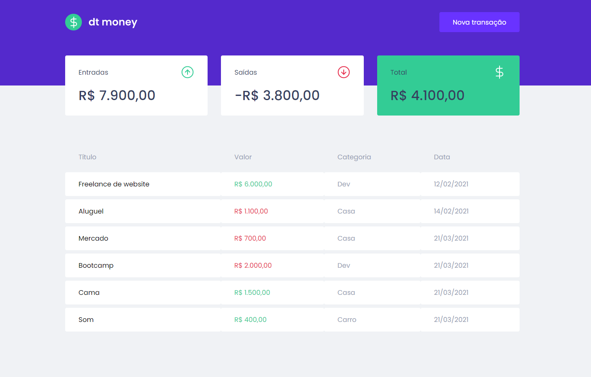
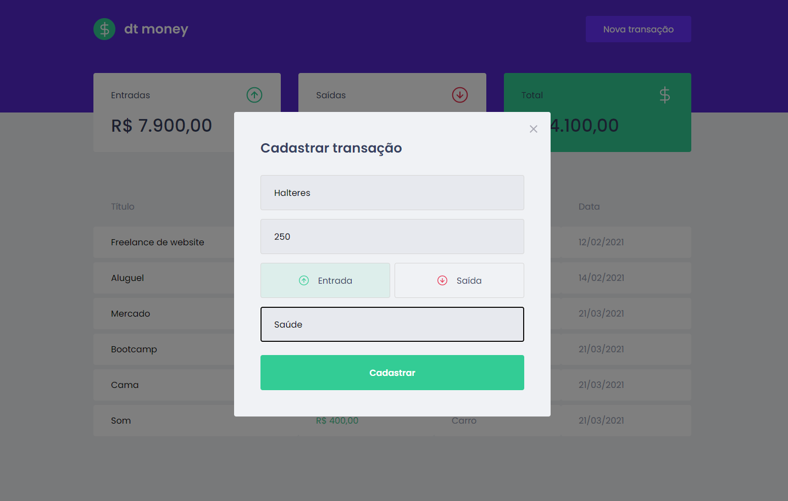

<h1 align="center">
  
</h1>

  
  

 

## 🚀 Tecnologias, Hooks e Bibliotecas

Esse projeto está sendo desenvolvido com as seguintes tecnologias:

- ReactJS
- TypeScript
- useState (hook que armazena dados que podem variar com o tempo, qualquer informação ou dado deve ser armazenado no useState, só assim será possível renderizar a informação para o frontend web ou mobile)
- useEfect (hook utilizado para controlar a execução de uma função a partir da alteração de um determinado parâmetro)
- Context API (compartilhamento de estado entre vários componentes da aplicação, utiliza o hook useContext())
- Styled Components (biblioteca que permite escrever códigos CSS dentro do Javascript)
- Mirage JS (biblioteca de simulação de API que permite construir, testar e compartilhar um aplicativo JavaScript funcional completo antes de ser desenvolvido o back-end)
- Axios (biblioteca usada no lugar de fetch(), que passa a não precisarmos repetir a digitação do endereço do servidor em cada requisição, informando apenas a rota e seus parâmetros, e também passamos a poder interceptar requisições e respostas pra nossa API antes de chegar no back-end para realizar alguma regra, por exemplo enviar algum token de autenticação)
- React Modal (biblioteca que renderiza o conteúdo de seu filho sobre um componente backdrop e fornece muitos recursos relacionados a interação destes dois)
- Polished (biblioteca que possui funções otimizadas de estilos para usar no JavaScript, como darken e transparentize)

## 💻 Projeto

O dtmoney é uma aplicação de controle financeiro com a mesma ideia que o [dev.finances](https://github.com/FelipeBrenner/maratona-discover-01-devfinances), porém com tecnologias e recursos estudados e utilizados mais avançados, bibliotecas open source desenvolvidas pela comunidade. Foi desenvolvida durante as aulas do Chapter II da trilha de ReactJS do Bootcamp Ignite da Rocketseat, e nela é possível cadastrar e excluir transações e ver o saldo de entrada e saída 💰

## 🔖 Layout

Você pode visualizar o layout do projeto através [desse link](https://www.figma.com/file/0xmu9mj2TJYoIOubBFWsk5/dtmoney-Ignite-(Copy)?node-id=0%3A1). É necessário ter conta no [Figma](https://figma.com) para acessá-lo.

---

Por Felipe Brenner
